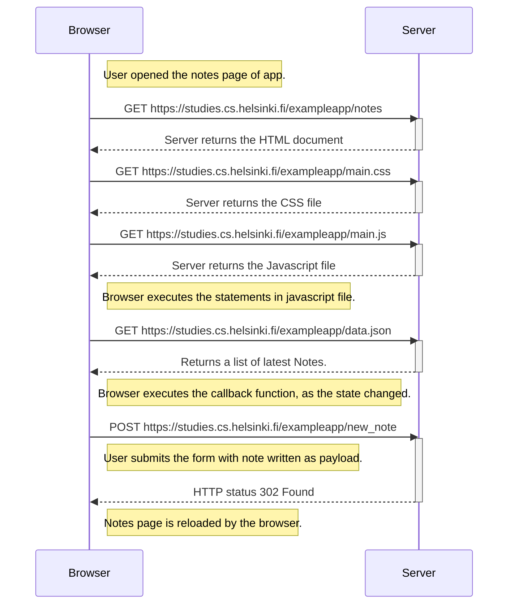

```mermaid
sequenceDiagram
Note right of Browser: User opened the notes page of app.
Browser->>Server: GET https://studies.cs.helsinki.fi/exampleapp/notes
activate Server
Server-->>Browser: Server returns the HTML document
deactivate Server
Browser->>Server: GET https://studies.cs.helsinki.fi/exampleapp/main.css
activate Server
Server-->>Browser: Server returns the CSS file
deactivate Server
Browser->>Server: GET https://studies.cs.helsinki.fi/exampleapp/main.js
activate Server
Server-->>Browser: Server returns the Javascript file
deactivate Server
Note right of Browser: Browser executes the statements in javascript file.
Browser->>Server: GET https://studies.cs.helsinki.fi/exampleapp/data.json
activate Server
Server-->>Browser: Returns a list of latest Notes.
deactivate Server
Note right of Browser: Browser executes the callback function, as the state changed. 
Browser->> Server: POST https://studies.cs.helsinki.fi/exampleapp/new_note
activate Server
Note right of Browser: User submits the form with note written as payload.
Server-->>Browser: HTTP status 302 Found
deactivate Server
Note right of Browser: Notes page is reloaded by the browser.
```