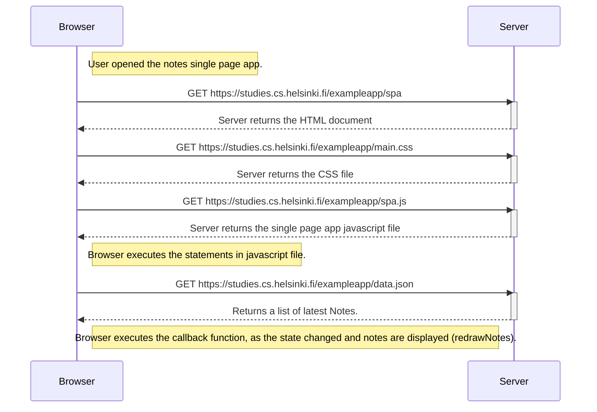

```mermaid
sequenceDiagram
Note right of Browser: User opened the notes single page app.
Browser->>Server: GET https://studies.cs.helsinki.fi/exampleapp/spa
activate Server
Server-->>Browser: Server returns the HTML document
deactivate Server
Browser->>Server: GET https://studies.cs.helsinki.fi/exampleapp/main.css
activate Server
Server-->>Browser: Server returns the CSS file
deactivate Server
Browser->>Server: GET https://studies.cs.helsinki.fi/exampleapp/spa.js
activate Server
Server-->>Browser: Server returns the single page app javascript file
deactivate Server
Note right of Browser: Browser executes the statements in javascript file.
Browser->>Server: GET https://studies.cs.helsinki.fi/exampleapp/data.json
activate Server
Server-->>Browser: Returns a list of latest Notes.
deactivate Server
Note right of Browser: Browser executes the callback function, as the state changed and notes are displayed (redrawNotes).
```