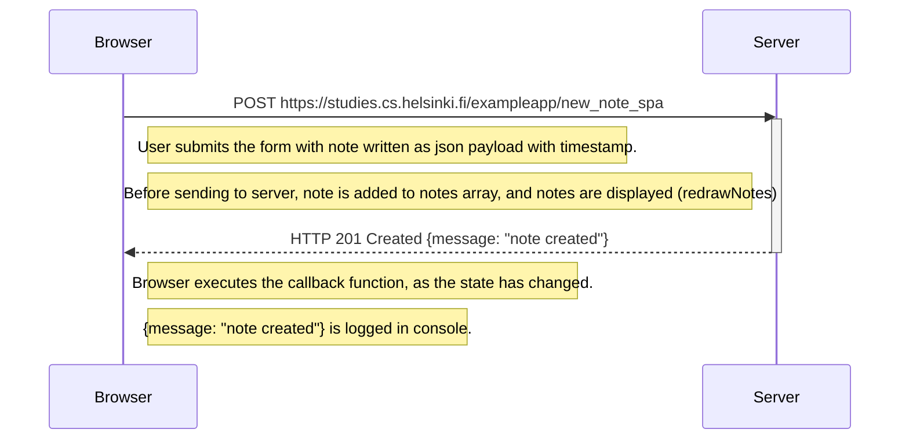

```mermaid
sequenceDiagram
Browser->> Server: POST https://studies.cs.helsinki.fi/exampleapp/new_note_spa
activate Server
Note right of Browser: User submits the form with note written as json payload with timestamp.
Note right of  Browser: Before sending to server, note is added to notes array, and notes are displayed (redrawNotes)
Server-->>Browser: HTTP 201 Created {message: "note created"}
deactivate Server
Note right of Browser: Browser executes the callback function, as the state has changed.
Note right of Browser: {message: "note created"} is logged in console.
```